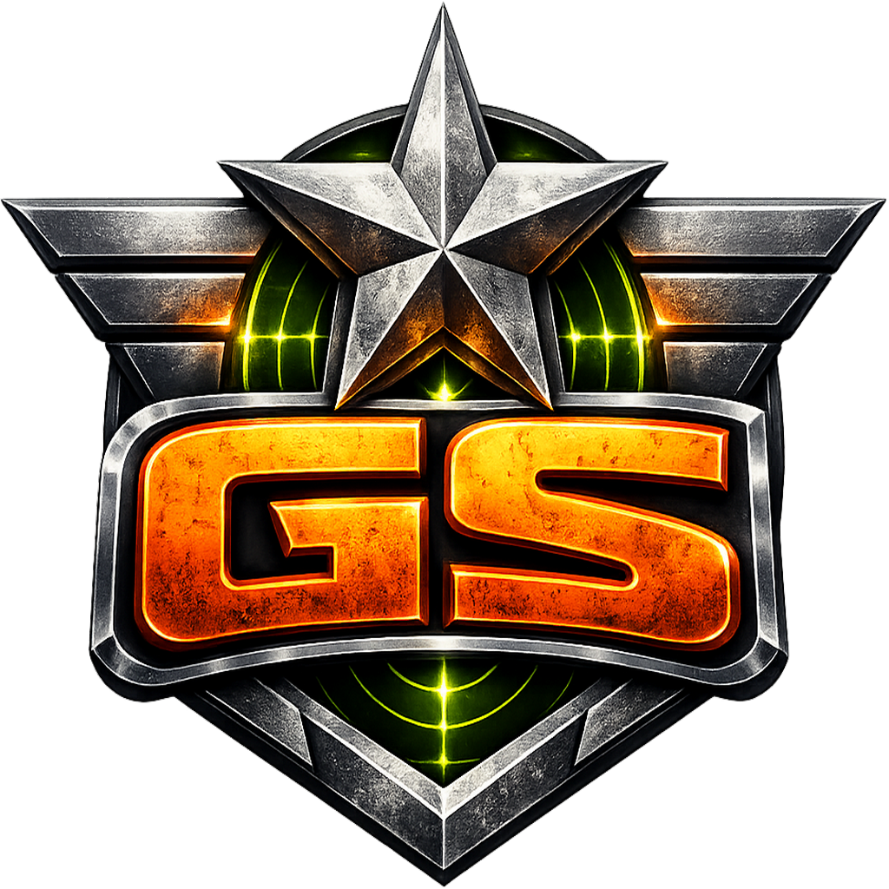
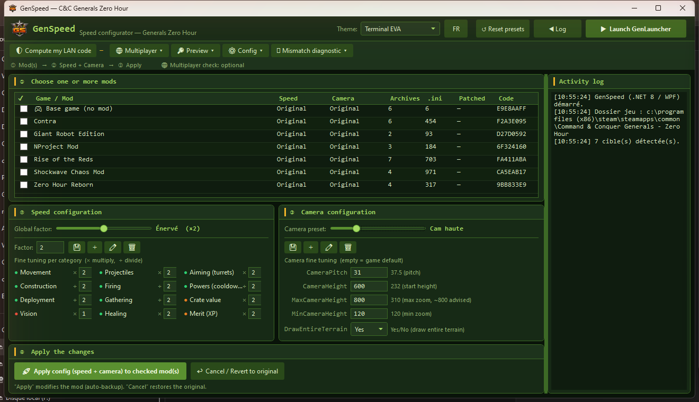
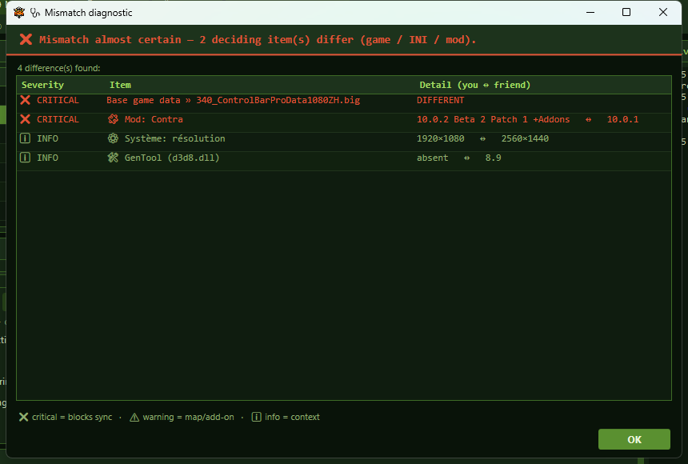
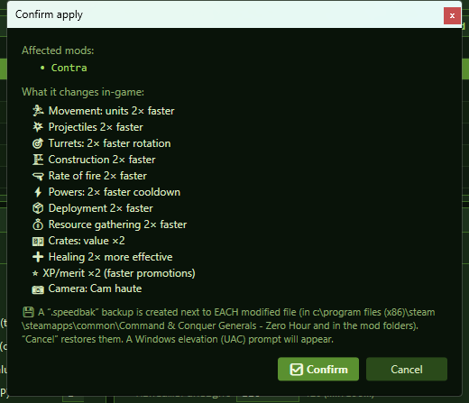
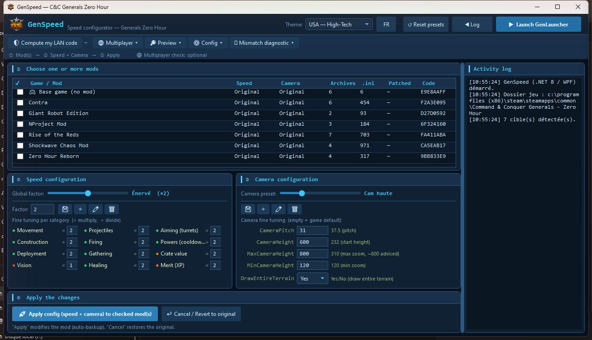
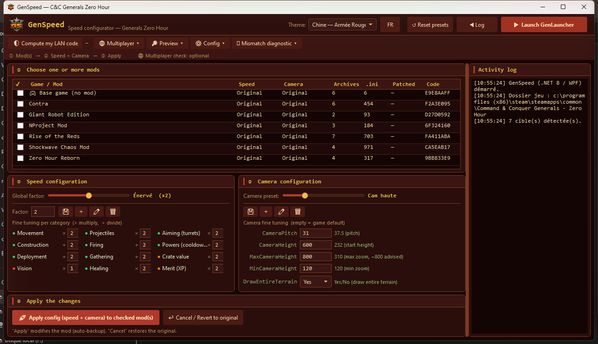

<div align="center">



# GenSpeed 🚀⚡

**Accélère le gameplay de *Command & Conquer™ Generals – Zero Hour* (et de ses mods), même en LAN.**
*Speed up the gameplay of C&C Generals: Zero Hour (and its mods), even in LAN.*

[](#)
[](LICENSE)
[](#)

</div>

> 🇫🇷 GenSpeed modifie les fichiers de données (`.ini`) du jeu/mod pour rendre les parties plus rapides : unités plus véloces, constructions/recharges plus courtes, presets de caméra. Plus un **outil de diagnostic de désync (mismatch) LAN** qui compare ton install à celle d'un ami et nomme exactement ce qui diffère.
>
> 🇬🇧 GenSpeed edits the game/mod `.ini` data to make matches faster: quicker units, shorter build/reload times, camera presets. Plus a **LAN mismatch (desync) diagnostic** that compares your install with a friend's and names exactly what differs.

---

## ✨ Nouveau dans la v2.1 / New in v2.1

🇫🇷
- 🖥️ **Multi-installations automatique** : GenSpeed découvre **toutes** tes installations (bibliothèques Steam, registre EA, ajouts manuels) et regroupe le tableau **par installation** — fini la notion d'« install active » à basculer à la main.
- 🧹 **Désinstalleur propre** (menu ⚙ Config) : analyse **toutes les installations détectées** et toutes les traces en **étapes ordonnées** (mods GenLauncher par mod **et par addon/patch**, GenLauncher, DLL GenTool, GenPatcher, données joueur, raccourcis, registre EA, résidus de compatibilité, traces de diagnostic Windows, le jeu — compatible Steam). Tout est expliqué, **rien n'est coché d'office**, tout est **sauvegardé dans un dossier daté avant suppression** (guide de restauration inclus), un **sélecteur de méthode global** applique un choix à tout en un clic, et un bouton **Simuler** montre ce qui se passerait sans rien toucher. Les **installeurs** (zip/exe de GenPatcher, GenTool, GenLauncher) ne sont **jamais touchés**.
- ✏ **Renommer les mods dans la liste** (affichage seulement — n'affecte ni le jeu ni le code LAN).
- 🔎 **Type d'installation dans la barre de titre** : Heure H d'origine / monde GenLauncher / fork autonome.
- 🚀 Lanceur mémorisé **par mod coché**, case « tout cocher » dans le tableau, clic droit « ouvrir le dossier » corrigé.

🇬🇧
- 🖥️ **Automatic multi-install** : GenSpeed discovers **all** your installs (Steam libraries, EA registry, manual adds) and groups the table **per install** — no more "active install" to switch by hand.
- 🧹 **Clean uninstaller** (⚙ Config menu): scans **every detected install** and every leftover in **ordered steps** (GenLauncher mods per mod **and per addon/patch**, GenLauncher, GenTool DLLs, GenPatcher, player data, shortcuts, EA registry, compatibility leftovers, Windows diagnostic traces, the game — Steam-aware). Everything is explained, **nothing pre-checked**, everything **backed up to a dated folder before deletion** (restore guide included), a **global method selector** applies one choice to all in a click, and a **Simulate** button shows what would happen without touching anything. **Installers** (GenPatcher / GenTool / GenLauncher zips & exes) are **never touched**.
- ✏ **Rename mods in the list** (display only — does not affect the game or the LAN code).
- 🔎 **Install type in the title bar**: original Zero Hour / GenLauncher world / standalone fork.
- 🚀 Launcher remembered **per checked mod**, select-all checkbox in the table, right-click "open folder" fixed.

<details>
<summary>✨ v2.0</summary>

- 🖥️ **Application autonome (.exe)** — plus besoin de Python / **Standalone .exe** — no Python required.
- 🎨 **3 thèmes** + **interface bilingue FR/EN** / 3 themes + bilingual UI.
- 🩺 **Diagnostic mismatch complet** : inventaire nommé de tout l'écosystème et comparaison entre joueurs / full named-inventory mismatch diagnostic.
- ⚡ Redimensionnement fluide, presets modifiables, confirmation détaillée avant patch.

</details>

---

## 📸 Aperçu / Screenshots

| Écran principal / Main window | Diagnostic mismatch |
|:---:|:---:|
|  |  |
| **Confirmation avant patch / Apply confirmation** | **Thèmes / Themes** |
|  |   |

---

## ⚙️ Configuration requise / Requirements

> ⚠️ **GenSpeed est conçu pour l'écosystème Steam + GenLauncher + GenPatcher.**
> *GenSpeed is designed for the Steam + GenLauncher + GenPatcher ecosystem.*

| | |
|---|---|
| **OS** | Windows 10 / 11 (64-bit) |
| **Jeu / Game** | C&C Generals – Zero Hour via **Steam** |
| **Mods** | gérés par **GenLauncher** (dossier `GLM`) / managed by **GenLauncher** (`GLM` folder) |
| **Patchs** | **GenPatcher** (patch communautaire, redists…) |
| **.NET** | ❌ rien à installer / nothing to install (runtime embarqué dans l'exe) |

**Ne fonctionne PAS avec / Does NOT work with :** versions CD/DVD, GOG, ou installations non-Steam.

---

## ⚙️ Installation

🇫🇷 GenSpeed est un **exécutable autonome** : pas d'installation, pas de Python, rien à décompresser. Les versions publiées se trouvent dans l'onglet **Releases** du dépôt (en haut de la page du projet, à côté de « Code »). Au lancement, GenSpeed **détecte automatiquement** ton install Steam et tes mods GenLauncher (sinon il demande le dossier une fois et le mémorise).

🇬🇧 GenSpeed is a **standalone executable**: no install, no Python, nothing to unzip. Published versions live on the repository's **Releases** tab (top of the project page, next to “Code”). On launch, GenSpeed **auto-detects** your Steam install and GenLauncher mods (otherwise it asks for the folder once and remembers it).

> 💡 Première utilisation : Windows SmartScreen peut afficher « éditeur inconnu » (l'exe n'est pas signé) → **Informations complémentaires → Exécuter quand même**.
> *First run: Windows SmartScreen may say "unknown publisher" (the exe isn't code-signed) → **More info → Run anyway**.*

---

## 🎮 Fonctionnalités / Features

- ✅ **Jeu de base + mods** (détection auto via GenLauncher / auto-detect via GenLauncher)
- ⚡ Paliers de vitesse **Original / Cool / Énervé / Déchaîné** + presets personnalisables
- 🎛️ Réglage **détaillé par catégorie** (déplacement, tir, construction, vision…)
- 🎥 **Presets de caméra** (vue haute, max, satellite… + personnalisés)
- 💾 **Sauvegarde + restauration automatiques** (`.speedbak`)
- 🛡️ **Code LAN** (hash) pour vérifier que tous les joueurs ont les mêmes fichiers
- 🩺 **Diagnostic mismatch** : exporte ton empreinte, compare avec un ami, verdict détaillé
- 🔎 Aperçu des valeurs (clés / exhaustif / modifiées) + ouverture du dossier du mod
- 📁 **Changer le dossier du jeu / des mods (GLM)** + **basculer entre plusieurs installations** depuis le menu ⚙ Config · ❔ **Aide intégrée**
- 🧹 **Désinstalleur propre** : retire proprement mods, GenLauncher, GenTool, GenPatcher, traces registre/Windows… avec **sauvegarde avant suppression** et mode **Simuler**
- ✏ **Renommer les mods dans la liste** · 🔎 **type d'install affiché** (origine / GenLauncher / fork)
- 🎨 3 thèmes · 🌐 FR/EN · 🔒 **Aucune télémétrie, aucune connexion internet**

---

## 🕹️ Utilisation rapide / Quick start

1. **Coche un ou plusieurs mods** dans la liste (clic sur la ligne). / **Check one or more mods** (click the row).
2. **Règle la vitesse** : Original (×1) · Cool (≈×1.5) · Énervé (≈×2, recommandé) · Déchaîné (≈×3).
3. **Caméra** (optionnel) : un preset ou réglages manuels. / **Camera** (optional): a preset or manual values.
4. **Appliquer la config** → une fenêtre récapitule ce que ça change, tu valides (UAC). / **Apply** → a window summarizes the changes, you confirm (UAC).
5. **▶ Lancer GenLauncher** et joue ! Pour revenir à l'original : **Annuler**.

🖱️ **Clic droit sur un mod** : aperçus + ouvrir son dossier. / **Right-click a mod**: previews + open its folder.

---

## 🌐 Multijoueur LAN & diagnostic mismatch

🇫🇷 En réseau, **tous les joueurs doivent avoir exactement les mêmes fichiers** (même jeu, même mod/version, mêmes réglages), sinon « mismatch / désync ». GenSpeed aide :

1. **🛡 Calculer mon code LAN** — un hash de ton install ; comparez-le, il doit être **identique**.
2. **🩺 Diagnostic mismatch** — chacun **exporte son empreinte** (un fichier `.json`), l'un de vous **compare** celle de l'autre. GenSpeed liste, **par gravité et avec des noms clairs**, ce qui diffère :
   - ❌ **Critique** (cause le désync) : version du jeu, INI, **mods + version** (« Contra 10.0.2 ↔ 10.0.1 »)
   - ⚠️ **Attention** : maps
   - ℹ️ **Info** (contexte) : GenTool, GenLauncher, addons, VC++ redists, résolution…
3. **📜 Dernier replay** — version + map + CRC de ta dernière partie.

🇬🇧 In LAN, **all players must have exactly the same files** or you get a mismatch/desync. GenSpeed's **🩺 diagnostic** has each player export a fingerprint and compares them, listing what differs **by severity with clear names** (e.g. "Mod Contra 10.0.2 ↔ 10.0.1"). The shared report contains **no personal data** — only file/mod/add-on names, versions and truncated hashes.

### 🗺️ Maps & mismatch — la règle d'or / the golden rule

🇫🇷
- **Une carte que vous ne jouez pas ne cause JAMAIS de désync.** Zero Hour ne charge que la carte de la partie en cours ; les cartes en trop dans ton dossier restent inertes. Tu peux en avoir plus que ton ami, aucun problème.
- **Ce qui doit être identique des deux côtés :** ① la **carte que vous jouez** (terrain `.map` **et** son `map.ini`), et ② les données chargées à **chaque** partie : **jeu de base + INI du mod + tes réglages GenSpeed**.
- **« Il me manque une carte » ≠ désync** : c'est juste une question de **disponibilité** — vous ne pouvez pas lancer *cette* carte tant que l'un ne l'a pas (le jeu peut la transférer). Une fois les deux pourvus et la carte identique, ça roule.
- **Les maps des mods sont embarquées dans le mod** → automatiquement identiques si vous avez la **même version de mod**. Rien à partager à la main.

🇬🇧
- **A map you don't play NEVER causes a desync.** Zero Hour only loads the current match's map; extra maps sit inert. Having more than your friend is harmless.
- **What must match on both sides:** ① the **map you actually play** (`.map` terrain **and** its `map.ini`), and ② the data loaded **every** match: **base game + mod INI + your GenSpeed settings**.
- **"I'm missing a map" ≠ desync** — it's just **availability**: you can't start *that* map until both have it (the game can transfer it). Once both have the same one, you're fine.
- **Mod maps are bundled inside the mod** → automatically identical if you share the **same mod version**. Nothing to share by hand.

> 💡 C'est pourquoi le diagnostic classe les **maps en ⚠️ Attention** (contextuel) et le **jeu / mods / réglages en 🔴 Critique** (chargés à chaque partie).
> *That's why the diagnostic rates **maps as ⚠️ Attention** (contextual) and the **game / mods / settings as 🔴 Critical** (loaded every match).*

---

## 🔧 Installation conseillée — ordre exact / Recommended install — exact order

> ⚠️ **Pour le LAN : fais EXACTEMENT les mêmes étapes, les mêmes versions et les mêmes options sur CHAQUE PC.** C'est ce qui évite les « mismatch / désync ».
> *For LAN: do the **exact same steps, versions and options on EVERY PC**. That's what prevents mismatches.*

**1. Jeu de base (Steam)** — installe *C&C Generals* + *Zero Hour (Heure H)* via Steam. **Lance Generals une fois**, puis **Zero Hour une fois**, et quitte. (Ça initialise le jeu : registre, dossier `Data`, `Options.ini` — indispensable avant de patcher.)
*Base game (Steam): install Generals + Zero Hour. Launch **Generals once**, then **Zero Hour once**, and quit, to initialize the game before anything else.*

**2. GenPatcher** — applique les **correctifs de compatibilité Windows 10/11** + redistribuables.
- 💡 **GenTool** : GenPatcher propose de l'installer — c'est **optionnel**. Pour **GenSpeed + LAN entre amis**, tu peux le **laisser de côté** (ou, si tu l'installes, le **désactiver** dans GenLauncher). Il sert surtout au **jeu en ligne classé / aux replays** et peut interférer avec des fichiers modifiés.
- *GenPatcher applies Win10/11 fixes + redists. GenTool is **optional** — for GenSpeed + LAN you can skip it (or disable it in GenLauncher). It's mainly for online/ranked play and may interfere with modified files.*
- 💡 **Autres extras GenPatcher** (tous **optionnels**) : *Control Bar Pro* (barre de commandes enrichie), **packs de maps** communautaires, *hotkeys*, *World Builder*. Les **hotkeys** et *World Builder* sont **purement locaux** (aucun impact multi). En revanche, pour le **Control Bar Pro** et les **packs de maps** : si tu les installes, **mets le même choix sur les deux PC**.
- *Other GenPatcher extras (all **optional**): Control Bar Pro, community **map packs**, hotkeys, World Builder. Hotkeys & World Builder are **purely local** (no multiplayer impact). For Control Bar Pro and map packs: if you install them, **use the same choice on both PCs**.*

**3. GenLauncher** (installé / mis à jour via GenPatcher). Configure les options ainsi :
*GenLauncher (installed/updated via GenPatcher). Set the options like this:*
- ✔ **Use default Camera height** — laisse **GenSpeed gérer la caméra** (évite un conflit).
- ✔ **Use modded .exe files**
- ✔ **Particles: 1000** · ✔ **Texture quality level: 0** *(préférence perfs/visuel)*
- ✔ **Use language: English** *(recommandé pour certains mods)*
- ✔ **Disable dynamic level of detail**
- ✘ **Tout le reste décoché** — surtout **Check Mod files integrity** (OFF, sinon il annule les modifs de GenSpeed) et **Hide GenLauncher while the game is running**.

**4. Test du jeu nu** — lance **Zero Hour une fois** via GenLauncher. S'il propose une **« recommended configuration » au 1er lancement → refuse-la** (pour garder tes options), et vérifie que le jeu démarre.
*Launch Zero Hour once via GenLauncher. If it offers a "recommended configuration" on first run → decline it, then check the game starts.*

**5. Mods** — installe chaque **mod + ses patchs/addons** via GenLauncher, puis **lance chacun une fois**. (Ça génère leurs fichiers, indispensable pour que GenSpeed les détecte et les patche.)
*Install each mod + its patches/add-ons via GenLauncher, then **launch each once** so GenSpeed can detect and patch them.*

**6. GenSpeed (en dernier)** — règle la vitesse/caméra, **Applique**, **Lance GenLauncher** → joue ! Pour revenir à l'original : **Annuler**.
*GenSpeed (last): set speed/camera, **Apply**, **Launch GenLauncher** → play! To revert: **Cancel**.*

---

## 🧠 Comment ça marche / How it works

- Lit les archives `.big`/`.gib` du jeu/mod et modifie les variables `.ini` (vitesses ×N, durées ÷N).
- Crée un `.speedbak` **à côté de chaque fichier** avant toute modification → **dépatch** = restauration exacte.
- Config locale dans `%LOCALAPPDATA%\GenSpeed` (aucune télémétrie).
- Patch identique **octet-pour-octet** à la v1.0 Python → compatibilité LAN entre toutes les versions.

*Reads the mod's `.big`/`.gib` archives, scales `.ini` variables, backs up each file as `.speedbak` (exact restore). Local config in `%LOCALAPPDATA%\GenSpeed`. Patching is **byte-for-byte identical** to the Python v1.0 → LAN-compatible across versions.*

---

## 🛠️ Compiler depuis les sources / Build from source

Le code C# (.NET 8 / WPF) est dans [`dotnet/`](dotnet/). / The C# code (.NET 8 / WPF) is in [`dotnet/`](dotnet/).

```powershell
cd dotnet
dotnet run --project src/GenSpeed.App      # lancer en dev / run in dev
.\publish.ps1                              # générer l'exe autonome / build the standalone exe
```

---

## ⚠️ Avertissements / Disclaimers

- **Non affilié à Electronic Arts.** *Command & Conquer™, Generals™, Zero Hour™* appartiennent à **Electronic Arts Inc.** Projet **amateur, non officiel**, sans lien avec EA ni les auteurs des mods.
- **À tes propres risques.** Fourni « TEL QUEL », **sans garantie**. L'auteur n'est **pas responsable** d'éventuels dommages, pertes de données ou bannissements.
- **Pas pour la triche en ligne / compétitive.** Conçu pour le solo et le **LAN entre amis**.

*Not affiliated with EA. Provided "AS IS", no warranty, use at your own risk. Not for online/ranked cheating — made for solo and LAN-with-friends play.*

---

## 🤖 À propos du code / About the code

🇫🇷 Le code de GenSpeed est **écrit par des IA** (Claude Code, etc.). Moi, je ne code pas : mon rôle est plutôt celui d'un **architecte / chef d'orchestre** — je définis la vision et les fonctionnalités, je guide les choix, je teste et j'oriente. GenSpeed existe parce que je voulais retrouver la rapidité de l'Escarmouche… mais en LAN entre potes. Avis aux moddeurs : ce serait génial de le peaufiner, voire de l'intégrer à GenLauncher 😉. Un bug, une idée ? Ouvre une **issue** !

🇬🇧 GenSpeed's code is **written by AI** (Claude Code, etc.). I don't write the code myself — my role is closer to an **architect / director**: I set the vision and features, guide the decisions, test and steer. GenSpeed exists because I wanted Skirmish-like speed in LAN with friends. Modders welcome to improve it! Found a bug or have an idea? Open an **issue**.

---

## 📜 Licence / License

MIT — voir [`LICENSE`](LICENSE). Libre d'utilisation, modification et partage, sans garantie.

*Command & Conquer™, Generals™ and Zero Hour™ are property of Electronic Arts Inc. This project is neither endorsed nor supported by EA.*

---

## 📝 Changelog

### v2.1
- 🖥️ **Multi-installations automatique** : découverte de toutes les installations (bibliothèques Steam, registre EA, ajouts manuels), tableau **groupé par installation** — suppression de la notion d'« install active »
- 🧹 **Désinstalleur propre** : scan **machine entière** en étapes ordonnées (mods par mod/addon/patch, GenLauncher, GenTool, GenPatcher, données joueur, raccourcis, registre EA + racine « EA Games » coquille vide, compatibilité, traces Windows, jeu — compatible Steam), méthode au choix par élément (laisser / désactiver / sauvegarder+supprimer / supprimer) **ou méthode globale en un clic**, **sauvegarde datée + guide de restauration**, mode **Simuler**, vérification DirectX 8 système après retrait de GenTool, mise à jour du catalogue GenLauncher après retrait. Les **installeurs ne sont jamais touchés**.
- ✏ **Renommage des mods** dans la liste (alias d'affichage par installation)
- 🔎 **Type d'installation** détecté et affiché (origine / monde GenLauncher / fork autonome)
- 🚀 Lanceur mémorisé **par mod coché** · case « tout cocher » · clic droit « ouvrir le dossier » corrigé
- 🏗️ Réorganisation interne du code (classes partielles) — aucun changement de comportement

### v2.0
- 🖥️ Réécriture complète en **C# / .NET 8 (WPF)** → **exe autonome**, plus de Python
- 🩺 **Diagnostic mismatch** avec inventaire nommé de l'écosystème (mods+versions, addons, GenTool, système)
- 🎨 **3 thèmes** + interface **bilingue FR/EN**
- 🛠️ Presets vitesse/caméra **modifiables** (CRUD), confirmation détaillée, clic droit + aperçus copiables
- 📁 **Changer le dossier du jeu** *et* **le dossier des mods (GLM)** depuis l'appli (menu ⚙ Config) — gère le cas où GenLauncher est installé **ailleurs**, avec conseils d'emplacement
- ❔ **Aide intégrée** (bouton ❔) : fenêtre d'aide bilingue (démarrage, vitesse/caméra, dossiers, LAN & mismatch, sauvegarde, à propos)
- ⚡ Redimensionnement fluide, persistance config, détection + sélection manuelle du dossier de jeu

### v1.0
- Système de patching, modes Simple/Avancé, presets caméra, vérification LAN, auto-détection Steam, sauvegarde/restauration, intégration GenLauncher & GenPatcher *(version Python — conservée dans l'historique git)*

---

<div align="center">

**Enjoy faster gameplay! 🚀⚡** · *Pour Steam + GenPatcher + GenLauncher.*

</div>
