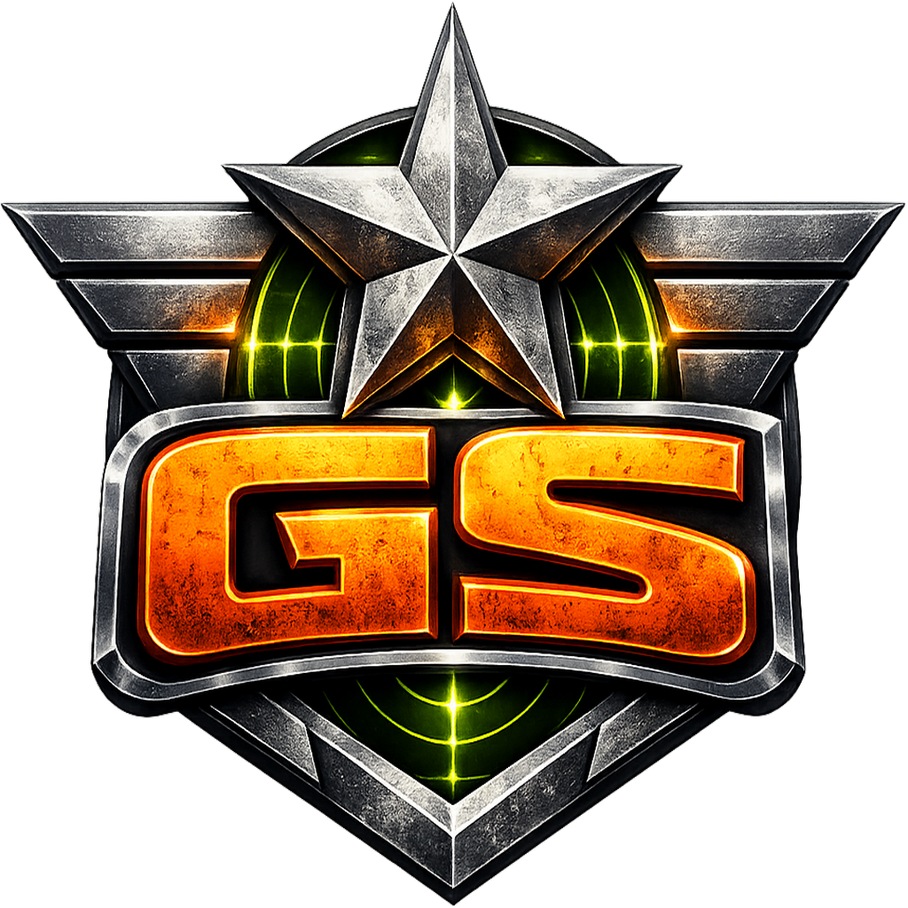
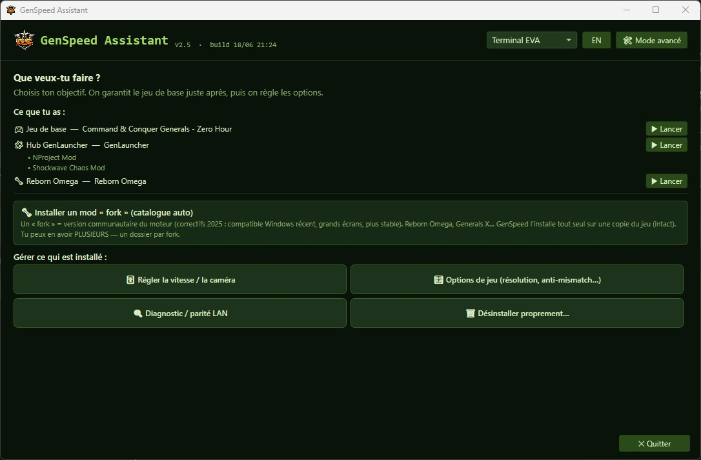
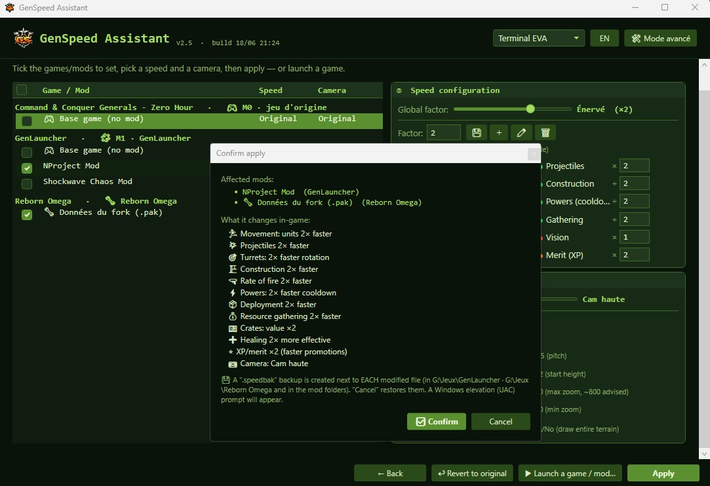
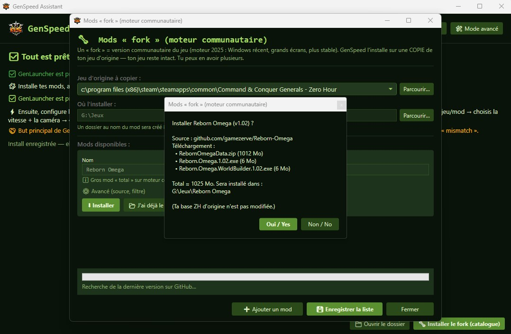
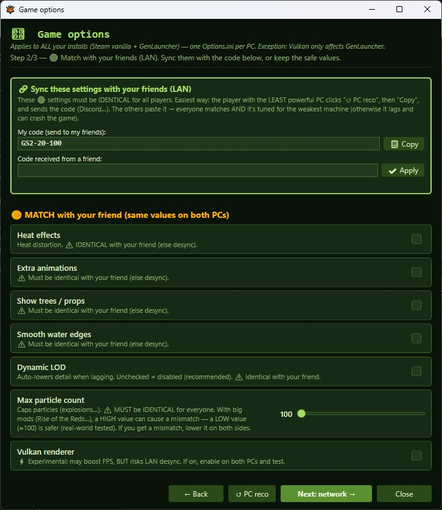
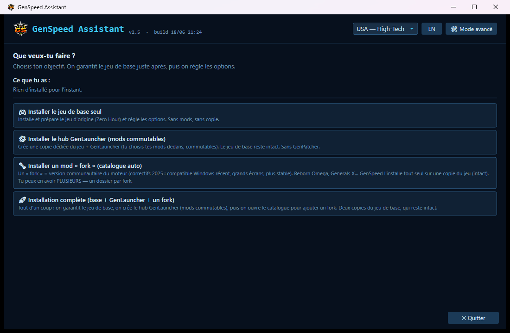
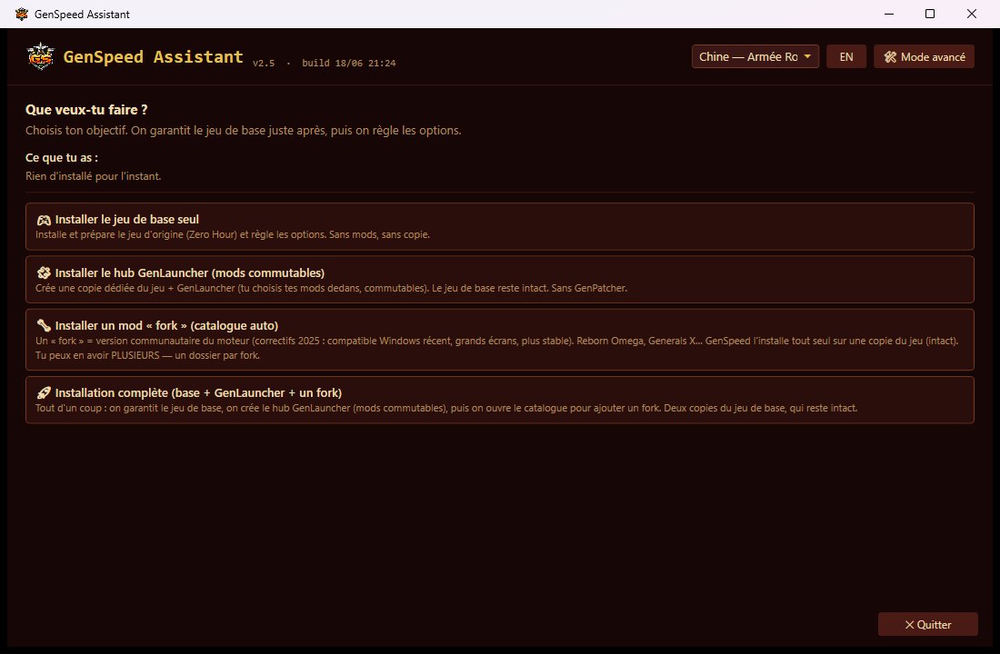

<div align="center">



# GenSpeed 🚀⚡

**Accélère le gameplay de *Command & Conquer™ Generals – Zero Hour* (et de ses mods), même en LAN.**
*Speed up the gameplay of C&C Generals: Zero Hour (and its mods), even in LAN.*

[](#-v25--assistant-tout-en-un--all-in-one-assistant)
[](#)
[](LICENSE)
[](#)

</div>

> 🆕 **v2.5 — l'assistant devient la porte d'entrée unique** : l'app démarre dessus (**splash** au lancement, puis un accueil « ce que tu as » + objectifs **en cartes cliquables**, plus de « Suivant »). Tes **mods GenLauncher** sont listés, chaque jeu/mod a son bouton **▶ Lancer**, et la **version/build** s'affiche dans l'en-tête. Fiabilité renforcée : une install sur **disque secondaire endormi ne disparaît plus**, et le suivi reflète fidèlement install/désinstall (fini les installs « fantômes »). Un souci, une idée ? Ouvre une **issue**.
> *🆕 **v2.5 — the assistant becomes the single front door**: the app starts on it (**splash** at launch, then a "what you have" home + goals as **clickable cards**, no more "Next"). Your **GenLauncher mods** are listed, each game/mod has a **▶ Launch** button, and the **version/build** shows in the header. More robust: an install on a **spun-down secondary drive no longer vanishes**, and tracking mirrors install/uninstall faithfully (no more "ghost" installs). Found a bug or have an idea? Open an **issue**.*

> 🇫🇷 GenSpeed modifie les fichiers de données (`.ini`) du jeu/mod pour rendre les parties plus rapides : unités plus véloces, constructions/recharges plus courtes, presets de caméra. Plus un **outil de diagnostic de désync (mismatch) LAN** qui compare ton install à celle d'un ami et nomme exactement ce qui diffère.
>
> 🇬🇧 GenSpeed edits the game/mod `.ini` data to make matches faster: quicker units, shorter build/reload times, camera presets. Plus a **LAN mismatch (desync) diagnostic** that compares your install with a friend's and names exactly what differs.

---

## 🆕 v2.5 — Assistant tout-en-un / All-in-one assistant

🇫🇷
- 🧙 **L'assistant est la porte d'entrée** : l'app démarre dessus — **splash au lancement**, puis un **accueil conscient de l'état** (« ce que tu as » : jeu de base, hub GenLauncher + ses mods, forks). Le **mode avancé** (tableau détaillé) reste à un clic.
- 🃏 **Tout en cartes, cliquable directement** : objectifs d'installation et choix lancés au clic (**plus de bouton « Suivant »**), un bouton **▶ Lancer** par jeu/mod, et les **actions de gestion** (vitesse/caméra, options, diagnostic, désinstaller) en cartes.
- 🧩 **Mods GenLauncher visibles** sur l'accueil, sous leur hub, avec leur réglage vitesse/caméra s'il existe — **rafraîchis automatiquement** au retour de GenLauncher.
- 🔖 **Version + build affichés** dans l'en-tête (tu vois d'un coup d'œil que tu lances le bon build).
- 🛡️ **Détection & désinstallation fiabilisées** : une install sur **disque secondaire endormi** ne disparaît plus ; « désinstaller tout » **tient le suivi à jour** (fini les installs « fantômes » après suppression).

🇬🇧
- 🧙 **The assistant is the front door**: the app starts on it — **startup splash**, then a **state-aware home** ("what you have": base game, GenLauncher hub + its mods, forks). The **advanced view** (detailed table) stays one click away.
- 🃏 **All cards, click-to-act**: install goals and choices launch on click (**no more "Next" button**), a **▶ Launch** button per game/mod, and **management actions** (speed/camera, options, diagnostic, uninstall) as cards.
- 🧩 **GenLauncher mods shown** on the home, under their hub, with their speed/camera setting if any — **auto-refreshed** when you come back from GenLauncher.
- 🔖 **Version + build shown** in the header (see at a glance you're running the right build).
- 🛡️ **More reliable detection & uninstall**: an install on a **spun-down secondary drive** no longer vanishes; "uninstall everything" **keeps tracking in sync** (no more "ghost" installs after removal).

<details>
<summary>✨ v2.4 — options de jeu (3 étapes) + réseau + assistant objectif-d'abord</summary>

🇫🇷
- 🎛️ **Sélecteur d'options de jeu en 3 étapes**, tout pré-coché selon **ton PC** (analyse locale GPU + RAM, **zéro télémétrie**) et **tout modifiable**, avec une **explication par option** (FR/EN) :
  - **① Libres** — résolution, souris, qualité graphique, anticrénelage, vitesse de défilement… (aucun risque LAN)
  - **② À aligner** — les **7 réglages anti-mismatch** (ceux que protège GenPatcher) + Vulkan, avec un **code de synchro court** (`GS2-…`) : le joueur au PC le moins puissant copie son code, les autres le collent → tout le monde **identique** d'un copier-coller.
  - **③ Réseau** — **choix de l'IP du jeu** pour le **LAN** et pour le **jeu en ligne** (comme dans Options → Réseau du jeu, **préréglé sur ton 192.168.x** → fini l'IP 172.x Hyper-V qui te rend invisible en LAN), le **délai d'envoi**, et une case **« autoriser le jeu dans le pare-feu Windows »** (Privé/Public).
- 🧙 **Assistant d'installation refait « objectif d'abord »** : on te demande d'abord **ce que tu veux** (🎮 juste jouer · 🧩 jouer aux mods (hub GenLauncher) · 📦 fork autonome), **en clair** ; puis on garantit le jeu de base, on règle les options, c'est tout. **Initialisation du jeu en mode fenêtré** (plus de crash si tu cliques ailleurs) avec une **vérification d'init fiable** (attend qu'`Options.ini` soit écrit).
- 🔗 **Liens de téléchargement éditables** (menu Config) : corrige une URL sans recompiler ; vérification HTTP intégrée.

🇬🇧
- 🎛️ **3-step game-options picker**, everything pre-checked for **your PC** (local GPU + RAM analysis, **zero telemetry**) and **fully editable**, with a **per-option explanation** (FR/EN):
  - **① Free** — resolution, mouse, graphics quality, anti-aliasing, scroll speed… (no LAN risk)
  - **② Match** — the **7 anti-mismatch settings** (the ones GenPatcher protects) + Vulkan, with a **short sync code** (`GS2-…`): the player with the weakest PC copies their code, the others paste it → everyone **identical** in one copy-paste.
  - **③ Network** — **pick the game's IP** for **LAN** and for **online** (like in-game Options → Network, **pre-set to your 192.168.x** → no more 172.x Hyper-V IP that makes you invisible on LAN), the **send delay**, and an **"allow the game through Windows Firewall"** checkbox (Private/Public).
- 🧙 **Reworked "goal-first" install assistant**: it first asks **what you want** (🎮 just play · 🧩 play with mods (GenLauncher hub) · 📦 standalone fork), in **plain words**; then secures the base game, sets the options, done. **Windowed game initialization** (no more crash if you click elsewhere) with a **reliable init check** (waits for `Options.ini` to be written).
- 🔗 **Editable download links** (Config menu): fix a URL without recompiling; built-in HTTP check.

</details>

<details>
<summary>✨ v2.3 — assistant d'installation propre (M0/M1/Mx) + calage multi automatique</summary>

- 🧙 **Assistant d'installation (sans GenPatcher)** : détecte ton jeu Steam (**M0**, gardé **vierge**) et crée un **hub GenLauncher (M1)** ou un **fork autonome (M2, M3…)** — copie propre, GenLauncher pré-configuré, raccourci Bureau.
- 🎚️ **Calage multijoueur AUTOMATIQUE** : à chaque démarrage, aligne les réglages anti-mismatch d'`Options.ini`, la résolution native, et la config GenLauncher — sans écraser tes choix.
- 📍 **Panneau « Mes installs »** (déplacer / re-pointer) · 🔄 **tableau auto-rafraîchi** · 🧹 **désinstalleur renforcé** (« 0 résidu »).

</details>

<details>
<summary>✨ v2.2 — vérifier les fichiers + diagnostic enrichi + désinstalleur durci</summary>

- 🛡️ **Vérifier les fichiers** (menu 🩺 Diagnostic) : verdict en clair par outil (connu/sans danger, faux positifs antivirus expliqués) + bouton **VirusTotal**.
- 🩺 **Diagnostic mismatch enrichi** : compare les **7 réglages anti-mismatch** d'`options.ini`, **distingue GenTool du wrapper d3d8to9**, vérifie le **serial LAN** (fantôme VirtualStore).
- 🧹 **Désinstalleur durci** : **VirtualStore**, **GenTool complet**, **addons GenPatcher**, et catégorie **« Restaurer les fichiers d'origine »**.

</details>

<details>
<summary>✨ v2.1 — multi-installations + désinstalleur propre</summary>

- 🖥️ **Multi-installations automatique** : découverte de toutes les installations, tableau groupé par installation.
- 🧹 **Désinstalleur propre** (étapes ordonnées, sauvegarde datée, simulation, méthode globale).
- ✏ Renommage des mods · 🔎 type d'installation affiché · 🚀 lanceur mémorisé par mod.

</details>

<details>
<summary>✨ v2.0</summary>

- 🖥️ **Application autonome (.exe)** — plus besoin de Python / **Standalone .exe** — no Python required.
- 🎨 **3 thèmes** + **interface bilingue FR/EN** / 3 themes + bilingual UI.
- 🩺 **Diagnostic mismatch complet** : inventaire nommé de tout l'écosystème et comparaison entre joueurs / full named-inventory mismatch diagnostic.
- ⚡ Redimensionnement fluide, presets modifiables, confirmation détaillée avant patch.

</details>

---

## 📸 Aperçu / Screenshots

| Accueil — « ce que tu as » / Home | Vitesse / caméra / Speed & camera |
|:---:|:---:|
|  |  |
| **Installer un fork (catalogue auto) / Install a fork** | **Options de jeu & sync LAN / Game options & LAN sync** |
|  |  |
| **Thème USA — assistant / USA theme** | **Thème Chine — assistant / China theme** |
|  |  |

---

## ⚙️ Configuration requise / Requirements

> ⚠️ **GenSpeed cible l'écosystème Steam + GenLauncher + GenPatcher**, et gère aussi les **forks « moteur 2025 »** (versions communautaires recompilées, ex. Reborn Omega — sans GenPatcher).
> *GenSpeed targets the Steam + GenLauncher + GenPatcher ecosystem, and also handles **"2025-engine" forks** (recompiled community builds, e.g. Reborn Omega — no GenPatcher needed).*

| | |
|---|---|
| **OS** | Windows 10 / 11 (64-bit) |
| **Jeu / Game** | C&C Generals – Zero Hour via **Steam** |
| **Mods** | gérés par **GenLauncher** (dossier `GLM`) / managed by **GenLauncher** (`GLM` folder) |
| **Patchs** | **GenPatcher** (patch communautaire, redists…) |
| **.NET** | ❌ rien à installer / nothing to install (runtime embarqué dans l'exe) |

**Ne fonctionne PAS avec / Does NOT work with :** versions CD/DVD, GOG, ou installations non-Steam.

---

## ⚙️ Installation

🇫🇷 GenSpeed est un **exécutable autonome** : pas d'installation, pas de Python, rien à décompresser. Les versions publiées se trouvent dans l'onglet **Releases** du dépôt (en haut de la page du projet, à côté de « Code »). Au lancement, GenSpeed **détecte automatiquement** ton install Steam et tes mods GenLauncher (sinon il demande le dossier une fois et le mémorise).

🇬🇧 GenSpeed is a **standalone executable**: no install, no Python, nothing to unzip. Published versions live on the repository's **Releases** tab (top of the project page, next to “Code”). On launch, GenSpeed **auto-detects** your Steam install and GenLauncher mods (otherwise it asks for the folder once and remembers it).

> 💡 Première utilisation : Windows SmartScreen peut afficher « éditeur inconnu » (l'exe n'est pas signé) → **Informations complémentaires → Exécuter quand même**.
> *First run: Windows SmartScreen may say "unknown publisher" (the exe isn't code-signed) → **More info → Run anyway**.*

---

## 🎮 Fonctionnalités / Features

- 🧙 **Assistant-accueil** : porte d'entrée unique, **conscient de l'état** (« ce que tu as » + mods) — **tout en cartes cliquables**, bouton **▶ Lancer** par jeu/mod, **mode avancé** (tableau) à un clic. / **Assistant home** as the single, state-aware front door — all cards, per-install Launch, advanced table one click away.
- 📦 **Installe pour toi** : jeu de base (Steam), **hub GenLauncher** (mods commutables), **forks autonomes** (moteur communautaire 2025, ex. Reborn Omega) — copies propres, le jeu d'origine reste **vierge**. / Installs for you: base game, GenLauncher hub, standalone forks — clean copies, original kept pristine.
- ✅ **Jeu de base + mods** (détection auto via GenLauncher / auto-detect via GenLauncher)
- ⚡ Paliers de vitesse **Original / Cool / Énervé / Déchaîné** + presets personnalisables
- 🎛️ Réglage **détaillé par catégorie** (déplacement, tir, construction, vision…)
- 🎥 **Presets de caméra** (vue haute, max, satellite… + personnalisés)
- 💾 **Sauvegarde + restauration automatiques** (`.speedbak`)
- 🛡️ **Code LAN** (hash) pour vérifier que tous les joueurs ont les mêmes fichiers
- 🩺 **Diagnostic mismatch** : exporte ton empreinte, compare avec un ami, verdict détaillé
- 🔎 Aperçu des valeurs (clés / exhaustif / modifiées) + ouverture du dossier du mod
- 📁 **Changer le dossier du jeu / des mods (GLM)** + **basculer entre plusieurs installations** depuis le menu ⚙ Config · ❔ **Aide intégrée**
- 🧹 **Désinstalleur propre** : retire proprement mods, GenLauncher, GenTool, GenPatcher, traces registre/Windows… avec **sauvegarde avant suppression** et mode **Simuler**
- ✏ **Renommer les mods dans la liste** · 🔎 **type d'install affiché** (origine / GenLauncher / fork)
- 🎨 3 thèmes · 🌐 FR/EN · 🔒 **Aucune télémétrie, aucune connexion internet**

---

## 🕹️ Utilisation rapide / Quick start

🇫🇷 Au lancement, GenSpeed s'ouvre sur l'**assistant** : un accueil **« ce que tu as »** (tes jeux/mods détectés) + des **objectifs en cartes**. Tout se fait au clic, pas de jargon.

1. **Régler la vitesse / caméra** (carte du même nom) → **coche** les jeux/mods à régler, choisis une **vitesse** (Original ×1 · Cool ≈×1.5 · Énervé ≈×2, recommandé · Déchaîné ≈×3) et une **caméra** (optionnel), puis **Appliquer** (UAC). « Revenir à l'original » annule.
2. **▶ Lancer** directement le jeu/mod depuis sa ligne dans « ce que tu as ».
3. **Installer** un jeu/mod : clique l'objectif voulu (**jeu de base** · **hub GenLauncher** · **fork** · **installation complète**) — GenSpeed fait le reste.
4. **Options de jeu**, **Diagnostic / parité LAN**, **Désinstaller proprement** : des cartes dédiées.
5. **🛠 Mode avancé** (en haut à droite) ouvre le **tableau détaillé** (toutes les installs/mods, code LAN, aperçus). **🤖 Assistant** y ramène.

🇬🇧 GenSpeed starts on the **assistant**: a **"what you have"** home (detected games/mods) + **goal cards**, all click-driven. Use **"Set speed/camera"** (tick targets → pick speed/camera → Apply), **▶ Launch** a game/mod from its row, or pick an **install goal**. **🛠 Advanced mode** opens the detailed table; **🤖 Assistant** brings you back.

---

## 🌐 Multijoueur LAN & diagnostic mismatch

🇫🇷 En réseau, **tous les joueurs doivent avoir exactement les mêmes fichiers** (même jeu, même mod/version, mêmes réglages), sinon « mismatch / désync ». GenSpeed aide :

1. **🛡 Calculer mon code LAN** — un hash de ton install ; comparez-le, il doit être **identique**.
2. **🩺 Diagnostic mismatch** — chacun **exporte son empreinte** (un fichier `.json`), l'un de vous **compare** celle de l'autre. GenSpeed liste, **par gravité et avec des noms clairs**, ce qui diffère :
   - ❌ **Critique** (cause le désync) : version du jeu, INI, **mods + version** (« Contra 10.0.2 ↔ 10.0.1 »)
   - ⚠️ **Attention** : maps
   - ℹ️ **Info** (contexte) : GenTool, GenLauncher, addons, VC++ redists, résolution…
3. **📜 Dernier replay** — version + map + CRC de ta dernière partie.

🇬🇧 In LAN, **all players must have exactly the same files** or you get a mismatch/desync. GenSpeed's **🩺 diagnostic** has each player export a fingerprint and compares them, listing what differs **by severity with clear names** (e.g. "Mod Contra 10.0.2 ↔ 10.0.1"). The shared report contains **no personal data** — only file/mod/add-on names, versions and truncated hashes.

### 🗺️ Maps & mismatch — la règle d'or / the golden rule

🇫🇷
- **Une carte que vous ne jouez pas ne cause JAMAIS de désync.** Zero Hour ne charge que la carte de la partie en cours ; les cartes en trop dans ton dossier restent inertes. Tu peux en avoir plus que ton ami, aucun problème.
- **Ce qui doit être identique des deux côtés :** ① la **carte que vous jouez** (terrain `.map` **et** son `map.ini`), et ② les données chargées à **chaque** partie : **jeu de base + INI du mod + tes réglages GenSpeed**.
- **« Il me manque une carte » ≠ désync** : c'est juste une question de **disponibilité** — vous ne pouvez pas lancer *cette* carte tant que l'un ne l'a pas (le jeu peut la transférer). Une fois les deux pourvus et la carte identique, ça roule.
- **Les maps des mods sont embarquées dans le mod** → automatiquement identiques si vous avez la **même version de mod**. Rien à partager à la main.

🇬🇧
- **A map you don't play NEVER causes a desync.** Zero Hour only loads the current match's map; extra maps sit inert. Having more than your friend is harmless.
- **What must match on both sides:** ① the **map you actually play** (`.map` terrain **and** its `map.ini`), and ② the data loaded **every** match: **base game + mod INI + your GenSpeed settings**.
- **"I'm missing a map" ≠ desync** — it's just **availability**: you can't start *that* map until both have it (the game can transfer it). Once both have the same one, you're fine.
- **Mod maps are bundled inside the mod** → automatically identical if you share the **same mod version**. Nothing to share by hand.

> 💡 C'est pourquoi le diagnostic classe les **maps en ⚠️ Attention** (contextuel) et le **jeu / mods / réglages en 🔴 Critique** (chargés à chaque partie).
> *That's why the diagnostic rates **maps as ⚠️ Attention** (contextual) and the **game / mods / settings as 🔴 Critical** (loaded every match).*

---

## 🔧 Installation conseillée — ordre exact / Recommended install — exact order

> 🤖 **L'assistant de GenSpeed automatise désormais l'essentiel** (install Steam, copie GenLauncher pré-configurée, options pré-réglées, forks via catalogue). Cette section reste la **référence manuelle** — utile pour comprendre, ou si tu installes à la main.
> *GenSpeed's assistant now automates most of this. This section is the manual reference — handy to understand the flow or to install by hand.*

> ⚠️ **Pour le LAN : fais EXACTEMENT les mêmes étapes, les mêmes versions et les mêmes options sur CHAQUE PC.** C'est ce qui évite les « mismatch / désync ».
> *For LAN: do the **exact same steps, versions and options on EVERY PC**. That's what prevents mismatches.*

**1. Jeu de base (Steam)** — installe *C&C Generals* + *Zero Hour (Heure H)* via Steam. **Lance Generals une fois**, puis **Zero Hour une fois**, et quitte. (Ça initialise le jeu : registre, dossier `Data`, `Options.ini` — indispensable avant de patcher.)
*Base game (Steam): install Generals + Zero Hour. Launch **Generals once**, then **Zero Hour once**, and quit, to initialize the game before anything else.*

**2. GenPatcher** — applique les **correctifs de compatibilité Windows 10/11** + redistribuables.
- 💡 **GenTool** : GenPatcher propose de l'installer — c'est **optionnel**. Pour **GenSpeed + LAN entre amis**, tu peux le **laisser de côté** (ou, si tu l'installes, le **désactiver** dans GenLauncher). Il sert surtout au **jeu en ligne classé / aux replays** et peut interférer avec des fichiers modifiés.
- *GenPatcher applies Win10/11 fixes + redists. GenTool is **optional** — for GenSpeed + LAN you can skip it (or disable it in GenLauncher). It's mainly for online/ranked play and may interfere with modified files.*
- 💡 **Autres extras GenPatcher** (tous **optionnels**) : *Control Bar Pro* (barre de commandes enrichie), **packs de maps** communautaires, *hotkeys*, *World Builder*. Les **hotkeys** et *World Builder* sont **purement locaux** (aucun impact multi). En revanche, pour le **Control Bar Pro** et les **packs de maps** : si tu les installes, **mets le même choix sur les deux PC**.
- *Other GenPatcher extras (all **optional**): Control Bar Pro, community **map packs**, hotkeys, World Builder. Hotkeys & World Builder are **purely local** (no multiplayer impact). For Control Bar Pro and map packs: if you install them, **use the same choice on both PCs**.*

**3. GenLauncher** (installé / mis à jour via GenPatcher). Configure les options ainsi :
*GenLauncher (installed/updated via GenPatcher). Set the options like this:*
- ✔ **Use default Camera height** — laisse **GenSpeed gérer la caméra** (évite un conflit).
- ✔ **Use modded .exe files**
- ✔ **Particles: 1000** · ✔ **Texture quality level: 0** *(préférence perfs/visuel)*
- ✔ **Use language: English** *(recommandé pour certains mods)*
- ✔ **Disable dynamic level of detail**
- ✘ **Tout le reste décoché** — surtout **Check Mod files integrity** (OFF, sinon il annule les modifs de GenSpeed) et **Hide GenLauncher while the game is running**.

**4. Test du jeu nu** — lance **Zero Hour une fois** via GenLauncher. S'il propose une **« recommended configuration » au 1er lancement → refuse-la** (pour garder tes options), et vérifie que le jeu démarre.
*Launch Zero Hour once via GenLauncher. If it offers a "recommended configuration" on first run → decline it, then check the game starts.*

**5. Mods** — installe chaque **mod + ses patchs/addons** via GenLauncher, puis **lance chacun une fois**. (Ça génère leurs fichiers, indispensable pour que GenSpeed les détecte et les patche.)
*Install each mod + its patches/add-ons via GenLauncher, then **launch each once** so GenSpeed can detect and patch them.*

**6. GenSpeed (en dernier)** — règle la vitesse/caméra, **Applique**, **Lance GenLauncher** → joue ! Pour revenir à l'original : **Annuler**.
*GenSpeed (last): set speed/camera, **Apply**, **Launch GenLauncher** → play! To revert: **Cancel**.*

---

## 🧠 Comment ça marche / How it works

- Lit les archives `.big`/`.gib` du jeu/mod et modifie les variables `.ini` (vitesses ×N, durées ÷N).
- Crée un `.speedbak` **à côté de chaque fichier** avant toute modification → **dépatch** = restauration exacte.
- Config locale dans `%LOCALAPPDATA%\GenSpeed` (aucune télémétrie).
- Patch identique **octet-pour-octet** à la v1.0 Python → compatibilité LAN entre toutes les versions.

*Reads the mod's `.big`/`.gib` archives, scales `.ini` variables, backs up each file as `.speedbak` (exact restore). Local config in `%LOCALAPPDATA%\GenSpeed`. Patching is **byte-for-byte identical** to the Python v1.0 → LAN-compatible across versions.*

---

## 🛠️ Compiler depuis les sources / Build from source

Le code C# (.NET 8 / WPF) est dans [`dotnet/`](dotnet/). / The C# code (.NET 8 / WPF) is in [`dotnet/`](dotnet/).

```powershell
cd dotnet
dotnet run --project src/GenSpeed.App      # lancer en dev / run in dev
# générer l'exe autonome (single-file compressé) / build the standalone exe:
dotnet publish src/GenSpeed.App -c Release -r win-x64 --self-contained `
  -p:PublishSingleFile=true -p:IncludeNativeLibrariesForSelfExtract=true -p:EnableCompressionInSingleFile=true
```

---

## ⚠️ Avertissements / Disclaimers

- **Non affilié à Electronic Arts.** *Command & Conquer™, Generals™, Zero Hour™* appartiennent à **Electronic Arts Inc.** Projet **amateur, non officiel**, sans lien avec EA ni les auteurs des mods.
- **À tes propres risques.** Fourni « TEL QUEL », **sans garantie**. L'auteur n'est **pas responsable** d'éventuels dommages, pertes de données ou bannissements.
- **Pas pour la triche en ligne / compétitive.** Conçu pour le solo et le **LAN entre amis**.

*Not affiliated with EA. Provided "AS IS", no warranty, use at your own risk. Not for online/ranked cheating — made for solo and LAN-with-friends play.*

---

## 🙏 Crédits & remerciements / Credits & acknowledgments

🇫🇷 GenSpeed s'appuie sur — et fonctionne aux côtés de — l'écosystème communautaire de C&C Generals. Tous ces projets sont **indépendants** ; merci à leurs auteurs et à la communauté. Droits & marques à leurs détenteurs respectifs.

🇬🇧 GenSpeed builds on — and works alongside — the C&C Generals community ecosystem. All these projects are **independent**; thanks to their authors and the community. Rights & trademarks belong to their respective owners.

- **Outils / Tools** : GenPatcher · GenLauncher · GenTool
- **Moteur recompilé « 2025 » & forks / Recompiled "2025" engine & forks** : GeneralsGameCode (TheSuperHackers) · Thyme · OpenSAGE — et les forks bâtis dessus, comme **Reborn Omega** / and forks built on it, such as **Reborn Omega**
- **Mods (GenLauncher)** : Rise of the Reds · ShockWave · Contra · NProject Mod · GRE…
- **Multijoueur & communauté / Multiplayer & community** : C&C:Online · GameRanger · et toute la communauté C&C / and the wider C&C community
- **Jeu d'origine / Original game** : *Command & Conquer™ Generals / Zero Hour* © **Electronic Arts**

> 🇫🇷 **Avant tout, GenSpeed sert à s'amuser.** En quelques clics, il **accélère les parties** (unités plus rapides, constructions et recharges plus courtes) et te laisse choisir la **caméra** — et ça marche **aussi bien en solo qu'en LAN entre potes**, ce que le jeu de base ne permet pas. C'est **simple** (une vitesse, une caméra, c'est parti) et **toujours annulable** : un bouton pour revenir à l'original.
>
> **« Et pourquoi GenSpeed n'utilise ni GenPatcher ni GenTool ? »** — Pas pour leur faire de l'ombre : ce sont d'excellents outils, et GenSpeed les détecte et les respecte. Simplement, pour ce qu'il fait (accélérer le jeu + jouer **en LAN entre potes sans bug de synchro**), il n'en a pas besoin :
> - **GenPatcher** prépare normalement le jeu pour un PC récent : il installe les **petits programmes que le jeu réclame pour démarrer** et **règle la résolution d'écran**. GenSpeed fait ces deux choses tout seul — il va chercher les programmes manquants **directement chez Microsoft**, et la résolution est gérée par **GenLauncher**. Résultat : **aucun outil de plus à installer**, et ton **jeu d'origine n'est jamais modifié** (GenSpeed travaille sur une **copie propre**, tout reste annulable).
> - **GenTool** sert surtout au **jeu en ligne classé**. Le souci en LAN : il **télécharge et met à jour certaines cartes tout seul, sans te prévenir** — et si ton PC et celui de ton copain n'ont pas exactement la même version, la partie **plante / se désynchronise**. Comme GenSpeed cherche justement à rendre les **deux PC identiques**, il le laisse **éteint par défaut** (c'est **réversible** : tu peux le réactiver quand tu veux).
>
> 🇬🇧 **First of all, GenSpeed is about fun.** In a few clicks it **speeds up matches** (faster units, shorter builds & reloads) and lets you pick the **camera** — in **solo and in LAN with friends**, which the base game doesn't allow. It's **simple** (one speed, one camera, done) and **always reversible**: one button back to the original.
>
> **"And why doesn't GenSpeed use GenPatcher or GenTool?"** — Not to overshadow them: they're great tools, and GenSpeed detects and respects them. It just doesn't need them for what it does (faster gameplay + **LAN with friends, no sync bugs**). GenPatcher normally readies the game for a modern PC — installing the **small programs the game needs to launch** and **setting the screen resolution**; GenSpeed does both itself (it fetches the missing programs **straight from Microsoft**, and **GenLauncher** handles resolution), so there's **no extra tool to install** and **your original game is never modified** (it works on a **clean copy**, all reversible). GenTool is mainly for **online/ranked** play; in LAN it **self-updates some maps on its own** — and if you and your friend don't have the exact same version, the match **desyncs** — so GenSpeed leaves it **off by default** (reversible; you can turn it back on anytime).

---

## 🤖 À propos du code / About the code

🇫🇷 Le code de GenSpeed est **écrit par des IA** (Claude Code, etc.). Moi, je ne code pas : mon rôle est plutôt celui d'un **architecte / chef d'orchestre** — je définis la vision et les fonctionnalités, je guide les choix, je teste et j'oriente. GenSpeed existe parce que je voulais retrouver la rapidité de l'Escarmouche… mais en LAN entre potes. Avis aux moddeurs : ce serait génial de le peaufiner, voire de l'intégrer à GenLauncher 😉. Un bug, une idée ? Ouvre une **issue** !

🇬🇧 GenSpeed's code is **written by AI** (Claude Code, etc.). I don't write the code myself — my role is closer to an **architect / director**: I set the vision and features, guide the decisions, test and steer. GenSpeed exists because I wanted Skirmish-like speed in LAN with friends. Modders welcome to improve it! Found a bug or have an idea? Open an **issue**.

---

## 📜 Licence / License

MIT — voir [`LICENSE`](LICENSE). Libre d'utilisation, modification et partage, sans garantie.

*Command & Conquer™, Generals™ and Zero Hour™ are property of Electronic Arts Inc. This project is neither endorsed nor supported by EA.*

---

## 📝 Changelog

### v2.5
- 🧙 **Assistant = porte d'entrée unique** : l'app démarre dessus (fenêtre non-modale), **splash logo** au lancement ; **mode avancé** (tableau) à un clic, retour assistant via le bouton dédié. En-tête affichant **version + horodatage du build**
- 🃏 **Accueil tout en cartes** : objectifs d'install et choix (jeu de base / hub GenLauncher / fork / installation complète) **lancés au clic** — suppression des boutons « Suivant » et des sélecteurs ; carte « Installer ici » sur la destination, cartes « Continuer/Terminer/Copier ». Composant vitesse/caméra partagé (mêmes blocs en mode avancé et dans l'assistant), tableau à gauche / réglages à droite
- 🧩 **Accueil conscient des mods** : « ce que tu as » liste les installs (JSON = source de vérité) **et leurs mods GenLauncher** (dossiers GLM contenant des `.gib`), avec le réglage vitesse/caméra mémorisé ; **bouton ▶ Lancer par install** ; **rafraîchissement auto** au retour de focus (mod installé/désinstallé dans GenLauncher visible directement)
- 🛡️ **Fiabilité détection/désinstall** : une install sur **disque secondaire endormi** ne disparaît plus (plus de purge au démarrage sur faux négatif `Directory.Exists` ; réveil anticipé des disques pendant le splash ; affichage « confiance au JSON »). **« Désinstaller tout » tient le JSON à jour** (`ForgetUninstalled` : retire known_installs + install_forks + états par chemin, puis persiste) → fini les installs **fantômes**. Un fork installé juste après un wipe est bien persisté
- 🔧 Divers : « ✕ Quitter » sur l'accueil (au lieu de fermer en mode avancé) ; fermer l'assistant quitte GenSpeed ; nettoyage de code mort

### v2.4 (beta)
- 🎛️ **Sélecteur d'options de jeu en 3 étapes** (① Libres / ② À aligner / ③ Réseau), **pré-coché selon le PC** (`PcInfo` : GPU via EnumDisplayDevices + RAM via GlobalMemoryStatusEx, 100 % local), **tout modifiable**, **une explication bilingue par option**. ~20 réglages couverts (résolution, souris, LOD, textures, anticrénelage, ombres, **ScrollFactor**, double-clic attaque-déplacement, riposte auto…)
- 🔗 **Code de synchro anti-mismatch court** (`GS2-XX-NNNN` : 7 booléens packés en 1 octet hexa + nb de particules) : copier/coller pour aligner les réglages entre joueurs LAN ; conseil intégré « caler sur le PC le moins puissant ». Recalculé **en direct** quand on coche
- 🌐 **Section Réseau** : choix de l'**IP LAN** (`IPAddress`) et **IP en ligne** (`GameSpyIPAddress`) parmi les cartes détectées (étiquetées réseau-local / virtuelle Hyper-V à éviter), **préréglées sur le 192.168.x** ; **SendDelay** déplacé ici ; **autorisation pare-feu Windows** (Privé/Public, règle entrante par exe, élevée/UAC, pré-cochée sauf si déjà posée)
- 🧙 **Assistant refait OBJECTIF-D'ABORD** : étape 1 = « que veux-tu ? » en clair (juste jouer / hub GenLauncher / fork autonome, **sans jargon M0/M1/Mx**) → jeu de base garanti → options. Étape options présente sur **tous** les chemins (un seul `Options.ini` global, vaut aussi pour le jeu de base). « Generals seul » abandonné (inutile, ZH se suffit)
- 🪟 **Initialisation du jeu en mode fenêtré** (`steam.exe -applaunch <appid> -win`) → plus de crash si on clique ailleurs pendant le chargement ; **vérification d'init fiable** (attend la création d'`Options.ini`, pas seulement `INIZH.big` consommé) avec message « init incomplète » + relance
- ⚡ AutoTune applique désormais **les choix de l'utilisateur** (`EffectiveIni` + Vulkan par install) ; `IsInitialized`, `SteamExePath`, `LaunchGameWindowed`, `ApplyOptionsValues`/`ReadOptionValue`/`SetYamlKey` ajoutés
- 🔗 **Registre de liens de téléchargement éditable** + vérification HTTP (URL Microsoft adaptée à la langue)

### v2.3 (beta)
- 🧙 **Assistant d'installation propre (GenPatcher-free)** : modèle **M0 / M1 / Mx** — M0 = jeu Steam d'origine **vierge** (source unique, auto-détectée, jamais touchée) ; **M1** = copie de M0 + GenLauncher (hub, dossier toujours « GenLauncher », emplacement par défaut proposé/éditable) ; **M2, M3…** = copies de M0 + fork autonome. Objectif contextuel (M1 unique → proposé une seule fois ; forks multiples → numérotés)
- 🎚️ **Calage multijoueur automatique** : `Options.ini` (15 clés anti-mismatch + perf) + **résolution native** (détectée, posée si absente) + `GenLauncherCfg.yaml` (GenSpeed-safe : GenTool off, CheckModFiles off…) calés **à chaque démarrage**, idempotent (n'écrit que si une valeur change). Pré-seed du YAML/Options.ini dès l'install (validé : GenTool n'est jamais installé)
- 📍 **Panneau « Mes installs »** : config JSON = source de vérité éditable (M0 inclus) ; **Déplacer** (physique, tout suit : `MoveInstall` + maj raccourci Bureau + known_installs), **Re-pointer**, **Retirer**, **Ajouter**. GenSpeed retrouve l'install GenLauncher via son raccourci Bureau (filet de secours)
- 🔄 **Tableau auto-rafraîchi** au retour sur la fenêtre (signature disque légère, pas de rescan inutile) + vidage si plus aucune install
- 🧹 **Désinstalleur** : 2ᵉ passage automatique, balayage des dossiers vides, **nettoyage post-Steam** (attente de la fin de Steam), **vérification finale « 0 résidu »** dans le journal
- 🚀 Raccourci Bureau GenLauncher (admin) · pré-création de l'`Options.ini` calé à l'install

### v2.2
- 🛡️ **Volet « Vérifier les fichiers »** (menu Diagnostic) : verdict en clair par binaire tiers (référence connue / non répertorié / non suivi, pastilles vert/orange/gris) + bouton **VirusTotal** (recherche par hash). Pédagogique : explique que les faux positifs heuristiques sur les outils non signés sont normaux
- 🩺 **Diagnostic mismatch enrichi** : 7 réglages `options.ini` anti-mismatch (DynamicLOD, ExtraAnimations, HeatEffects, MaxParticleCount, SendDelay, ShowSoftWaterEdge, ShowTrees), identification du `d3d8.dll` (GenTool vs wrapper d3d8to9), serial LAN `ergc` (alerte seulement si fantôme VirtualStore **divergent**)
- 🧹 **Désinstalleur durci** : VirtualStore (clés EA fantômes + serials), GenTool complet (`d3d8.cfg`, `GenToolUpdater`, maps `[RANK]/[NMC]`), addons GenPatcher (`.big` Control Bar/hotkeys/décals), catégorie **« Restaurer les fichiers d'origine »** (`.bak`/`.GLR`), clé registre `EA Games\ZeroHour`, sous-dossiers `x64/x86\7z.dll`
- 🔎 Référence d'intégrité **known-good** des binaires tiers (neutre, non bloquante)

### v2.1
- 🖥️ **Multi-installations automatique** : découverte de toutes les installations (bibliothèques Steam, registre EA, ajouts manuels), tableau **groupé par installation** — suppression de la notion d'« install active »
- 🧹 **Désinstalleur propre** : scan **machine entière** en étapes ordonnées (mods par mod/addon/patch, GenLauncher, GenTool, GenPatcher, données joueur, raccourcis, registre EA + racine « EA Games » coquille vide, compatibilité, traces Windows, jeu — compatible Steam), méthode au choix par élément (laisser / désactiver / sauvegarder+supprimer / supprimer) **ou méthode globale en un clic**, **sauvegarde datée + guide de restauration**, mode **Simuler**, vérification DirectX 8 système après retrait de GenTool, mise à jour du catalogue GenLauncher après retrait. Les **installeurs ne sont jamais touchés**.
- ✏ **Renommage des mods** dans la liste (alias d'affichage par installation)
- 🔎 **Type d'installation** détecté et affiché (origine / monde GenLauncher / fork autonome)
- 🚀 Lanceur mémorisé **par mod coché** · case « tout cocher » · clic droit « ouvrir le dossier » corrigé
- 🏗️ Réorganisation interne du code (classes partielles) — aucun changement de comportement

### v2.0
- 🖥️ Réécriture complète en **C# / .NET 8 (WPF)** → **exe autonome**, plus de Python
- 🩺 **Diagnostic mismatch** avec inventaire nommé de l'écosystème (mods+versions, addons, GenTool, système)
- 🎨 **3 thèmes** + interface **bilingue FR/EN**
- 🛠️ Presets vitesse/caméra **modifiables** (CRUD), confirmation détaillée, clic droit + aperçus copiables
- 📁 **Changer le dossier du jeu** *et* **le dossier des mods (GLM)** depuis l'appli (menu ⚙ Config) — gère le cas où GenLauncher est installé **ailleurs**, avec conseils d'emplacement
- ❔ **Aide intégrée** (bouton ❔) : fenêtre d'aide bilingue (démarrage, vitesse/caméra, dossiers, LAN & mismatch, sauvegarde, à propos)
- ⚡ Redimensionnement fluide, persistance config, détection + sélection manuelle du dossier de jeu

### v1.0
- Système de patching, modes Simple/Avancé, presets caméra, vérification LAN, auto-détection Steam, sauvegarde/restauration, intégration GenLauncher & GenPatcher *(version Python — conservée dans l'historique git)*

---

<div align="center">

**Enjoy faster gameplay! 🚀⚡** · *Pour Steam + GenPatcher + GenLauncher.*

</div>
